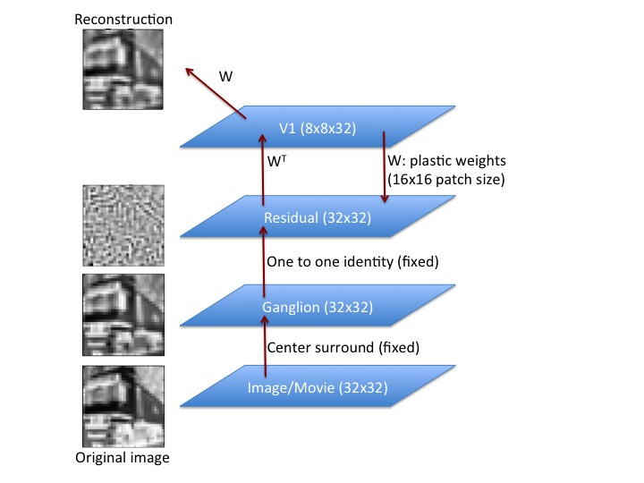
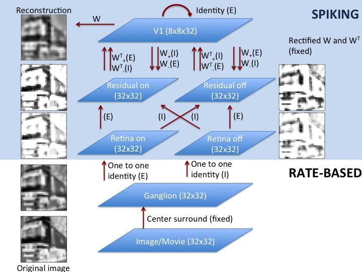

% Spiking LCA - Midterm report
% Miha Pelko (mpelko@gmail.com)
% March 21, 2014

# Introduction

## Goal of the project

The aim of the project is to translate a part of the standard LCA algorithm into the versions where the nodes (neurons) in the algorithm as emitting spikes instead of holding and passing continuous values. (for spiking hardware implementation). 

At this point the goal is solely to translate the second part of the LCA algorithm - to sparsely represent the inputs. We outsource the learning of the input statistics to the original algorithm.

## General LCA algorithm

LCA algorithm is used to sparsely represent the information based on the learned statistics of the input. 

Figure \ref{fig:rate_arch} shows the specific architecture used in our base LCA implementation.

The algorithm performs two basic steps:

* **Learn the statistics of the input**: The statistics are represented in the dictionary of weights (W in figure \ref{fig:rate_arch}) between the Residual and the V1 layer which are being learned .

* **Sparsely represent the inputs**: Given the learned weights, we represent the input by the activity in V1, which is sparser then the activity in the lower layers.

Within the LCA we learn the weights W by presenting the various instances of inputs to the algorithm, which is trying to sparsely represent them given the current set of weights W. The more inputs we present to the algorithm, the better it learns the weights and thus the statistics of the inputs. This in turn means it is able to better represent the input in a sparse fashion.

A more detailed description of how the weights are learned is beyond the scope of this report (See papers of Rozwell, Olshausen, ...).

# Methods

## Input used

We are using the greyscale version of the images from the [CIFAR10 dataset](http://www.cs.toronto.edu/~kriz/cifar.html) within the project. The dataset was chosen as the images are small enough (32x32 pixels) to allow for fast testing and development.

## The architecture of the spiking algorithm

Figure \ref{fig:spiking_arch} shows the specific architecture used in our spiking LCA implementation. 

The input (Image/Movie) and the ganglion layers are exactly the same as in the rate architecture and are outputting continuous real numbers (rate-based). The output of the ganglion layer is passed into the retina layer (one-to-one connectivity), which converts the continues real numbers into discrete events (spikes), where the frequency of the events corresponds to the magnitude of the ganglion output. The timing statistics of the events follow the poisson distribution.

Since the frequency of the events is always positive, while the output of the ganglion layer can be negative, we create two subpopulations in the retina layer. One would spike when the input to it is positive (on) and the other when the input is negative (off).

The outputs of retina layer are then passed onto the spiking residual layer (again one-to-one connectivity to the on/off subpopulations). Finally the residual population is reciprocally connected to the V1 layer (where the activity is always positive even in the rate model). The connectivity is following the same pattern as in the rate model, including the weight values. What we need to change to reflect the rate architecture is to split the W matrix to the positive and negative part (as the connections can only be excitatory (E) or inhibitory(I)) and take into account that we now have two residual subpopulations.

Finally the V1 layer is connecting to itself with the excitatory one-to-one connectivity.

## Results

### Spiking LCA can represent the images
[Source file name: CIFAR10Spiking_W_sweep_v2.ipynb]

To reconstruct the images we first count the numbers of spikes per node within a certain time window (default 500 ms) in the V1 layer, while the original image is presented. The spike count constitutes the V1 activity. Using the weights W we then transpose this activity into the image reconstruction.

Figure \ref{fig:reconstructions} shows some of the ganglion outputs and their reconstructions using the spiking LCA architecture.

While the the reconstructions seem a bit blurry, it visually seems most of the image information is still present in the reconstruction. Next we explore the quality of the reconstructions more systematically.

### The quality of the reconstructions
[Source file name: CIFAR10Spiking_W_sweep_v2.ipynb]

We explore the error of the spiking LCA reconstructions using the L2 error. We first normalise the original and the reconstruction images to have zero mean and variance of 1. L2 error is the standard deviation of the difference between the two. For a random normalised image, the average L2 error would be 1.

Figure \ref{fig:ratesVserrors} shows the error as a function of the number of spikes emitted within the time window for different parameter settings. The parameters we are changing are the weight factors on the connections between residual and V1. As the spiking neurons are not linear (as opposed to the rate neurons), we try out different weight factors to obtain best solutions. We use the following set of parameters:

* ST: general strengths of the res->V1->res connections
* EI: The ratio between excitatory and inhibitory strength factor
* UD: The ratio between res->V1 and V1->res strength factor

We can see how using less spikes will typically result in a bigger reconstruction error. 

We then compare the results to the results of the rate-based system, where we transpose the V1 activity from the rate model into the spikes (stars in the figure \ref{fig:ratesVserrors}). Different colours represent different limits for the max. number of spikes for a certain neuron.

![Quality of the reconstruction in the spiking LCA. The circles represent the reconstruction results for individual images. Different colours denote different parameter set (see the main text for details). The stars show the rate-based solutions represented using the optimal number of spikes per node. Different colours reflect the different parameter set for rate$\rightarrow$spiking transformation (essentially limiting the number of spikes). 
Using less spikes to represent the image will generally increase the reconstruction error. We can see the spiking LCA even in the limit of many spikes will not catch up to the rate-based solution.\label{fig:ratesVserrors}](./images/rateVsSpiking.pdf)

We see that the spiking LCA never really catches up with the quality of the rate-based reconstructions.

### The temporal summation
[Source file name: CIFAR10Spiking_duration_test.ipynb]

In order to reconstruct the image from the spiking activity in V1, we have to sum up the spikes. In figure \ref{fig:temporal} we explore how the quality of the reconstruction depends on the temporal window used for the summation.

### Scaling with the increased input
[Source file name: CIFAR10Spiking_retinaFG_sweep.ipynb]

As both the reconstruction precision as the energy consumption scale with the number of spikes, we look for a mechanism to manipulate the firing frequency in the V1 layer (the sparse reconstruction layer).

We take the size of the input from the Retinal layers to the residual layer  as the candidate for the regulation of firing rates in V1 (NOTE: implemented through changing forgroundRate parameter in the Retina layers). The results are shown in figure \ref{fig:increased_input}.

